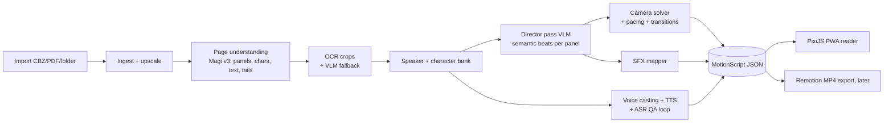

# MangaMotion: Product Requirements Document

*Personal tool · v1.2 · 1 Oct 2026 · private use only, no distribution*

Product requirements updated from user feedback after M0b. MotionScript remains v1; this document version is separate from the data contract.

**Target hardware (v1.2): RTX 4050 Laptop GPU, 6 GB VRAM.** See §5.7 (voice engines) and §8 (VRAM plan). Nothing here assumes more than 6 GB is free at once.

**One-liner:** Turn any manga chapter into a motion-comic experience (context-aware camera moves, per-character AI voices, sound effects) while keeping the original art pixels untouched.

---

## 0. Decisions at a glance

| Question | Decision | Why |
|---|---|---|
| Where does the AI run? | **Offline, per chapter.** Output is a `MotionScript` (JSON + audio files). The reader only plays it. | Smooth playback, no waiting mid-read, and AI mistakes can be fixed *before* you read. |
| How is the camera "context-aware"? | **Two stages:** a VLM tags each panel with semantic beats (mood, energy, focus). A **deterministic camera solver + rule table** turns tags into keyframes. | LLMs are good at "what is happening", bad at pixel coordinates. A solver guarantees bubbles are never cropped and motion stays comfortable. |
| Master clock | **Audio.** Camera keyframes attach to voice-line start times. | Voice/visual sync is exact; panel duration falls out of the dialogue. |
| Page understanding | **Magi v3** (panels, characters, text, bubble tails, OCR, character grounding) + specialist OCR + VLM verification on low-confidence items | Only open model that handles order + speaker tails + OCR together. |
| Voices | **Locked reference clips per character** (an *emotion bank*), cloned for every line, plus an ASR quality loop. **Hybrid engines:** Fish Audio cloud API for expressive principal-character lines; Kokoro and Qwen3-TTS 0.6B locally for narrator and background voices. | Stops timbre drift; gives real emotion control without a 24 GB GPU. |
| Hardware fit (6 GB) | **One heavy model in VRAM at a time**, run as staged jobs with explicit unload. Heavy or optional pieces (VLM director, expressive voices) go to **cloud APIs**. | The full local stack does not fit at once on 6 GB, but each stage fits alone. |
| Reader | **Web PWA on PixiJS.** One texture per page; the camera is a transform on it. | Original art is never re-encoded or regenerated. |
| Art fidelity rule | Only *camera, parallax, shake, glow, and audio* are added. No regenerated pixels. | This is the "retain manga originality" requirement. |

---

## 1. Problem, goals, non-goals

**Problem.** Reading static manga is less dynamic than anime, but full AI video destroys the art and drifts on characters. Motion comics that keep the original art exist, but they are hand-made.

**Goals**
1. Any chapter (CBZ/PDF/folder) becomes a playable motion comic with **zero manual work** in the happy path.
2. Camera behavior *feels directed*: it reacts to mood, action, and who is speaking.
3. Each character has a **consistent, believable voice** across the whole series.
4. Errors (wrong speaker, bad OCR, wrong order) are **visible and fixable in seconds**.
5. Always one gesture away from the original page.

**Non-goals (v1):** generative video or redrawing; colorization; public release or sharing; multi-user; webtoon/manhwa vertical-strip mode (parked, see open questions); heavy or cloud background music generation. Quiet local tonal music that follows scene mood is now in scope; see §14.

**Success criteria (personal):** across 3 test chapters (dialogue-heavy, action-heavy, gag), you choose motion mode over static reading at least 70% of the time, with no motion-discomfort incidents, and a chapter is ready to read within about 15 minutes of import.

---

## 2. Principles
1. **Never hide or alter the art.** Bubbles are never cropped unless a deliberate reveal.
2. **Audio is the clock.** Visuals follow voice.
3. **Restraint beats spectacle.** Most panels get subtle motion. Big moves are earned by high energy.
4. **Confidence is first-class.** Use calibrated scores when the verified adapter provides them. If it does not, confidence is explicitly unavailable (`null`) with review flags; never invent a probability or silently treat absence as certainty. Low scores are flagged. Numeric calibration requires an independent labeled set and remains deferred under user-approved D26.
5. **Swap-friendly.** Every model sits behind an adapter. The TTS field in particular is moving weekly.

---

## 3. Experience spec (UX)

### 3.1 Screens
- **Library:** series → chapters, with a processing ring per chapter. Pages stream in as the pipeline finishes them, so you can start reading page 1 before page 20 is done.
- **Reader:** the main experience.
- **Cast:** characters, sample crops, voice cards, audition buttons.
- **Review queue:** only low-confidence items (speaker unsure, OCR unsure, order unsure), shown as thumbnails to confirm or fix.
- **Settings.**

### 3.2 Reader modes
| Mode | Behavior |
|---|---|
| **Tap-paced** (desktop default / optional mobile) | Each tap advances one beat. Motion and voice play for the panel, then wait for you. You control pace like reading, but with life. |
| **Anime / Auto** | Auto-plays on the audio clock; dwell follows dialogue/caption reading time plus art inspection, and later voice duration. Tap to pause. See §14/F04. |
| **Flow (mobile default)** | Vertical thumb scroll selects the next/previous scene in manga reading order; camera transitions settle naturally, without repeated transport-button clicks. See §14/F03. |
| **Silent** | Camera glides panel-to-panel with subtle motion, no voices. For public places. |
| **Classic** | Plain static page reader. |

### 3.3 Gestures
- Tap right/left zone: next/previous beat (direction-aware for RTL).
- Tap during playback: skip to the end state of this panel.
- Long-press: pause and zoom out to the full page with the current panel outlined ("where am I").
- Two-finger tap: replay panel.
- Long-press on a bubble: **Fix** sheet (change speaker, edit text, change emotion, re-voice, mute line).
- Swipe down: page overview.

### 3.4 HUD and settings
- Minimal HUD: thin progress bar; optional speaker chip (name + emotion) while a line plays. The active bubble gets a soft pulse/glow so your eye follows the voice.
- **Motion intensity:** Off / Subtle / Normal / Hype (scales zoom, speed, shake).
- **Reduce motion** (disables shake, whip pans, punch-ins).
- Per-character volume and mute, narrator on/off, SFX on/off, voice speed 0.8x to 1.5x (time-stretch), reading direction, night mode.
- **Dub/Sub toggle** if the source is Japanese raw: hear original-language voices or the translated language.

### 3.5 Timing rules (defaults, tunable)
- Auto dwell must scale with dialogue/caption reading length, with a tunable initial English 240 wpm baseline plus art-inspection/beat time. Do not impose an upper cap that prevents reading dense dialogue. This is a starting setting, not a measured manga average; see §14/F04 and its research source. Later speech duration sets a lower bound; music duration never determines panel dwell.
- Gap between lines in the same panel: 120 ms; across speakers: 350 ms; after an SFX: 200 ms; panel tail: 300 to 600 ms.
- Silent panel dwell = `clamp(0.8 + 0.6 × visual_complexity, 0.8, 2.5)` s. Splash pages: 2.5 to 4 s.

---

## 4. System architecture



**Deployment (personal):** Python pipeline on your RTX 4050 laptop in staged, one-model-at-a-time mode (WSL2 recommended for Linux-first repos); the PWA is served from the same machine and reached from your phone over Tailscale. Chapters stream to the reader as they finish.

**Repo layout:** `/pipeline` (Python 3.11, FastAPI, SQLite job table + worker) · `/reader` (TypeScript, Vite, PixiJS) · `/schema` (JSON Schema shared by both) · `/library/<series>/<chapter>/{pages,audio,motionscript.json,cache}`.

---

## 5. Pipeline modules

### 5.1 Ingest
- Accept CBZ/ZIP/PDF/folder → immutable original assets and SHA-256 indexed serving pages (cache key for everything downstream). As approved in D05, serve original image bytes where the browser supports them; use pixel-identical lossless PNG for TIFF. Keep PDF containers untouched and render one page at a time to lossless PNG at a recorded resolution (initial default 144 dpi).
- No ingest upscale or generated fill under the original-pixel hard constraint; use source-resolution camera limits.
- Per-series config: reading direction, source language, target language.

M1a is implemented and verified on the five supplied pages in folder, CBZ and PDF fixtures. See `reports/M1a.md` for acceptance evidence, measured timings, RAM/VRAM and supported-input limits. This produces an import manifest, separate from MotionScript v1; later slices connect it to chapter processing and the reader.

### 5.2 Panels and reading order
- **Primary:** Magi v3 (detects panels; ordering via its transcript logic).
- **Fallback for borderless/irregular layouts:** Kumiko (OpenCV contours) or a YOLO panel detector; SAM-based polygons for irregular panels (per Panelizer's survey of options).
- Validate: panels should cover ≥ 70% of the page area (else flag); order sanity check (RTL, no overlaps); full-page splash gets a single "panel".
- **Manual override** is a drag-to-fix UI in the Review queue. Corrections are saved and become your golden-set labels.

**M1b implementation evidence (1 October 2026):** imported pages now produce normalized detections, bounded RTL/LTR order, crop-only OCR and review reasons. The verified Magi detector method does not itself invoke transcript sorting; the implementation uses a bounded page-cut solver with explicit ambiguity flags (D27). Five supplied RTL pages yield 25 panels and 53 text crops. Provisional engineer labels score 25/25 panels at IoU ≥0.5, 5/5 whole-page order and 0/195 dialogue word edits; these are not blind/independent accuracy claims. The models omit calibrated confidence; the user approved D26's explicit-unavailable exception when authorizing M1c. Numerical calibration remains deferred. See `reports/M1b.md`.

### 5.3 Text detection and fast OCR
**Flow:** detect text boxes once per page (Magi v3; `comic-text-detector` as fallback) → **crop bubbles only** (8 px pad) → **batch OCR on GPU** → confidence gate → VLM re-read for anything below threshold.

| Language | First choice | Alternatives |
|---|---|---|
| Japanese | `manga-ocr` (ONNX) or PaddleOCR-VL-For-Manga | Hayai OCR v2 (faster; JP/ZH/KO, not tuned for English) |
| English / Chinese | **Baberu OCR** (115M, JP/ZH/EN, Apache-2.0) | PaddleOCR-VL; VLM read |
| Fallback | VLM (Claude/Gemini/Qwen-VL) on the crop | |

**Speed tactics (all required):**
1. Crops, never full-page OCR.
2. Persistent worker with models kept warm (no per-page loading), fp16, batch size 16 to 32.
3. Pipeline stages overlap: page N in OCR while page N+1 in detection.
4. Cache by page hash. Re-runs are free.
5. Background-process the next chapter while you read the current one.
6. **Filter early:** classify text as dialogue / caption / SFX / sign (Magi v2 introduced an essential-vs-non-essential text head). Only dialogue and captions get voices; SFX goes to the SFX mapper.

**Post-processing:** strip furigana, normalize punctuation and ellipses, join multi-line, fix common OCR confusions with a small per-series glossary (names).

### 5.4 Speaker attribution and character identity (the hardest step)
Layered so each layer catches the previous layer's errors:
1. **Tail-aware association (Magi):** speech-bubble tails are the artist's own "who is speaking" signal.
2. **Conversation constraints:** bubble chains in one panel alternate speakers unless the tail/caption says otherwise; narration boxes → narrator.
3. **VLM verification on low-confidence lines only:** send the panel crop with numbered boxes overlaid (set-of-marks style): *"Which character number is speaking bubble 3? Answer JSON with confidence."*
4. **Identity across pages/chapters:** Magi's clustering gives per-chapter identities. Magiv2's character bank (names + exemplar images for ~11K characters in 76 series) can auto-name principal characters when your series is covered; otherwise you name them once in the Cast screen. Identities persist in a per-series **character store** (face/body embeddings + labels), so chapter 2 starts already cast.
5. **Fallbacks:** unresolved lines default to "last speaker in the panel" or the narrator voice and go to the Review queue.
6. **Human loop:** long-press a bubble → reassign. Every fix updates the character store.

### 5.5 Director pass (semantic understanding per panel)
One VLM call **per page** (keeps continuity), with: page image, per-panel crops, detected boxes with IDs, previous-page summary carried forward, and per-series notes (genre, tone). Temperature 0, JSON-schema constrained output, cached by page hash.

Output per panel (no coordinates; only references to box IDs):
```json
{
  "beat": "establish|dialogue|reaction|reveal|impact|chase|comedy|flashback|quiet|transition",
  "shot": "wide|medium|closeup|extreme_closeup|splash|insert",
  "energy": 0.0,
  "mood": ["tense"],
  "focus": [{"kind": "face|object|bubble|region", "ref": "char_3"}],
  "motion_vector": [dx, dy],
  "time_skip": false,
  "lines": [{"bubble": "b7", "speaker": "c1", "delivery": "speak|shout|whisper|think|narrate|cry|laugh", "intensity": 0.6}],
  "sfx": [{"text": "ドン", "category": "impact"}]
}
```
Cost: about one call per page, so a 20-page chapter is 20 calls. Local Qwen-VL is the offline fallback.

### 5.6 Camera solver: context-based camera movement
**Algorithm per panel:**
```
beats  = build_beats(lines, sfx, director.beat)          # durations from TTS audio
master = fit(panel.bbox, viewport)                        # full-panel framing
for beat in beats:
    target = pick_target(beat, director.focus)            # speaker face / bubble / object / region
    rect   = fit_rect(target, viewport_aspect, margin=0.12)
    rect   = clamp(rect, panel.bbox + bleed)              # never leave the panel
    rect   = ensure_visible(rect, active_bubbles)         # never crop a bubble being read
    move   = MOVE_TABLE[director.beat][energy_band]
    keyframes += move.instantiate(prev_rect, rect, beat.duration)
```
Keyframes are `{t, cx, cy, scale}` in page coordinates.

**Move table (defaults):**

| Beat / context | Camera move | Parameters | Extras |
|---|---|---|---|
| **Establish / wide, calm** | Slow drift along reading direction | scale 1.00→1.08, 4 to 6 s, ease-in-out | ambience bed |
| **Dialogue** | Hold medium framing; **speaker-follow** glide to the current speaker's face/bubble at each line start | glide 300 to 450 ms; return to master if ≥ 3 speakers | active-bubble glow |
| **Emotional close-up** | Slow push-in onto eyes/face (upper ~35% of character box) | 1.00→1.25, 3 to 5 s, ease-out | duck ambience; optional heartbeat |
| **Shock / realization** | Punch-in, 2-frame hold, flash frame | 1.00→1.35 in ~180 ms (ease-out-expo), then slow creep | impact SFX |
| **Impact / action** | Smash cut in; shake decaying over ~250 ms; radial zoom on speed lines | shake amplitude ≤ 1.5% of viewport × energy | hit SFX, hit-stop |
| **Chase / directional motion** | Pan along `motion_vector` at constant velocity; slight motion blur | scale 1.05 | whoosh SFX |
| **Splash / big reveal** | **Tilt reveal:** start on a detail, pull back or tilt to the full art | 3 to 4 s, then hold | optional swell |
| **Comedy / reaction** | Springy bounce punch-in with overshoot | 1.2 to 1.8 s | comic SFX |
| **Flashback** | Very slow drift, soft vignette, dissolve in/out | 1.00→1.04 | low-pass on ambience |
| **Quiet / silent panel** | Minimal Ken Burns | 1.00→1.04, dwell per §3.5 | none |

**Hard constraints (motion comfort):** max scale 1.4x; max sustained zoom rate 0.6x per second (punch-ins excepted); max sustained pan speed about 1.2 panel-widths per second (whip pans excepted); ≤ 3 impact shakes per page; **Reduce motion** disables shake, whip, and punch-in. Focus target stays inside the central 60% of the viewport. Bubble text must remain at least a minimum on-screen size, or the camera widens.

**Transitions:**

M1c implements a restrained CPU solver with original page/text protection, analytic scale/speed bounds and pre-publication/reader validation, without VLM direction. Candidate glides exceeding sustained comfort limits become cuts; page boundaries use fades. Text-box size is audited as a proxy only; actual glyph readability on the target phone remains unverified. See D28 and `reports/M1c.md`; the full move table remains M3 work.

| Situation | Transition | Duration |
|---|---|---|
| Same scene, adjacent panels | Direct camera glide from rect A to rect B | 250 to 400 ms |
| Action → action | Whip-pan along the motion vector + blur | 150 to 220 ms |
| Impact | Smash cut + 2-frame hold | 0 |
| Time skip / scene change (`time_skip`) | Cross-dissolve or dip to paper-white | 400 to 600 ms |
| Page turn | Soft push through gutter or fade | ~200 ms |

**Presets:** Subtle / Normal / Hype are just multipliers over these parameters. Prior art to mine: DynamicManga (Cao et al., IEEE TMM), which infers per-panel motion and emotion and simulates camera moves from film-production rules; and the shot recipes in `video-shotcraft`.

### 5.7 Voices: casting, emotion, QA

**Casting flow**
1. After chapter 1 detection, characters are listed with sample crops and a few lines.
2. The VLM drafts a **Voice Card**: gender, age band, personality, voice descriptors (from crops and dialogue).
3. For each principal character, generate **3 candidate voices** with a voice-design model. You audition in the Cast screen and lock one.
4. From the locked voice, build a small **emotion bank**: 3 to 4 short reference clips in different deliveries (neutral, shout, whisper, sad).
5. Every line is synthesized as **clone(reference clip)**, choosing the bank clip that matches the Director's `delivery`. Engines that accept inline tags (Fish) also get the tag. Locking references prevents the drift you get from re-designing a voice per line.
6. Background characters get a shared pool of preset voices by gender/age. Narrator gets one fixed voice.
7. Prefer *designed* or your own reference voices over cloning real voice actors from anime clips. That is legally and ethically grayer even for personal use.

**Engine plan for a 6 GB card** (adapter: `synthesize(text, voice_id, emotion, intensity, lang) → wav`). Engines take emotion differently, so the adapter maps `delivery` to whatever mechanism the engine has. Figures come from model cards, vendor docs, and third-party write-ups, so **verify in the M2 bake-off**.

| Role | Engine | Runs where | Emotion mechanism |
|---|---|---|---|
| **Expressive lines (principal characters)** | **Fish Audio S2.1 Pro, cloud API** (same family as open S2 Pro) | Cloud, 0 GB VRAM | Free-form inline tags like `[whisper]`, `[shouting]`; clone from a 10 to 30 s reference; 83 languages |
| **Local cast engine** | **Qwen3-TTS 0.6B Base** | Local, roughly 2 to 4 GB (sources disagree) | No instruction input on Base, so use the **emotion bank** |
| **One-time voice design** | Qwen3-TTS 1.7B VoiceDesign (~6 GB, run alone) or Fish `voice-design-1` API (~$0.01 per request) | Borderline locally; cloud is safer | Describe the voice in text |
| **Narrator / thoughts / previews** | **Kokoro** (82M, < 2 GB, CPU-capable) | Local | None (presets) |
| **Not for 6 GB** | Local Fish S2 Pro, Breeze TTS 2, Voxtral TTS, Step Audio EditX | Need 12 GB or more | n/a |

**Fish Audio, in detail**
- **Local open weights:** Fish's own docs recommend a GPU with at least 24 GB for S2 Pro. Community FP8 and NF4 builds bring it to roughly 12 GB; community INT4/GGUF files exist at ~2.4 to 9 GB *on disk*, but disk size is not runtime VRAM, and their quality and runtime support are unverified. **Not planned for the 4050.** Local install also targets Linux/WSL.
- **Cloud API (recommended path):** listed at $15 per million UTF-8 bytes for `s2.1-pro`. A free `s2.1-pro-free` model existed under fair use with no latency or data guarantees, and one report said free access ran through end of July 2026 with notice before changes, so **check current terms**.
- **Cost estimate (my arithmetic):** ~5,000 English characters per 20-page chapter is about $0.08. Japanese is 3 bytes per character, so about $0.15 to $0.20. Roughly **10 to 20 cents per chapter**, only for the lines you route to Fish.
- **Privacy:** only dialogue text and short reference clips leave your machine, never page images. Free-tier terms said requests may be used to improve the model.
- **Routing rule:** principal characters' shout/whisper/cry lines → Fish; everything else → local. A setting lets you go fully local.

**Emotion mapping** (Director's `delivery` → engine control):

| Delivery | Visual cue | Control |
|---|---|---|
| speak | round bubble | neutral |
| shout | jagged/burst bubble, large bold text | shout instruction/tag, intensity 0.7 to 1.0 |
| whisper | dashed/small bubble, small font | whisper tag |
| cry / tremble | wavy tail, stammer, ellipses | trembling tag |
| think | cloud bubble, no tail | soft delivery + post-FX (low-pass, light reverb) |
| narrate | rectangular caption | narrator voice |
| laugh / sigh / gasp | "haha", "…!?" | paralinguistic tag if the engine supports it, else drop |

**Quality loop (automatic, per line):**
1. Synthesize → transcribe with faster-whisper → normalized WER vs script.
2. Fail if WER > ~15% or duration is an outlier for the text length → retry up to 3 seeds → else flag for review.
3. **Speaker-embedding check** against the character's reference clip; retry if below threshold (calibrate on your voices). Strong emotion can shift timbre, and this catches it.
4. Trim silence, match loudness per character (target about −16 LUFS integrated), limit peaks at −1.5 dBTP, encode Opus.

**Throughput:** render lines in batches per chapter; cache by `hash(text, voice, emotion, intensity, engine version)`. Serve engines via `vllm-omni` (Qwen3-TTS, Fish S2 Pro, VoxCPM2 supported) or LocalAI behind one OpenAI-style `/v1/audio/speech` shim.

### 5.8 SFX and ambience
- Onomatopoeia text (classified as SFX in 5.3) → LLM maps to a category (impact, whoosh, footsteps, door, heartbeat, rain…) → lookup in a **local SFX library** (CC0/licensed packs; `video-shotcraft` ships a categorized set with license URLs) → fallback generate with **Stable Audio Open** (up to 47 s clips).
- Mixing: SFX at about −6 dB under voice, ambience beds low, and duck ambience during lines. Quiet tonal music following story mood is now in scope (§14/F02): local stems/procedural tones, separate bus, scene continuity, crossfades, mutes and ducking. No new cloud music API or heavy music generation model is authorized.

### 5.9 2.5D layers (phase 2, opt-in per panel)
- Final acceptance requires character cutouts to feel lifted from the page, with distinct depth planes, not just a whole-page zoom. Preserve source pixels and test seams/occlusion/text visibility. See §14/F01; camera-only fallback on unsafe panels does not close the overall depth requirement.
- The Director flags panels where characters separate cleanly from the background.
- **Character cutout:** verify a segmentation adapter using Magi character boxes, then use only original source pixels in layered transforms. The original LaMa/inpaint proposal is superseded by the art-fidelity hard constraint and D06: no invented background fill. Prove coverage/occlusion safety or use original artist-provided layers; otherwise keep that panel camera-only.
- **Parallax** = tiny differential translation (≤ 1 to 2% of width) plus scale delta between layers, synchronized with the camera move.
- **Depth-map displacement** (Depth Anything V3 / Depth Pro / DepthFlow) is an *experiment only*. Depth on black-and-white line art is unreliable and warps the linework. Keep amplitude tiny or skip.
- **Bubble sequencing** (hide bubbles until spoken) is a stretch goal. Default stays glow-only to preserve the page.

### 5.10 Reader runtime
- **Stack:** TypeScript, Vite, **PixiJS** (WebGL). Page = one texture (tiled if taller than the device's texture limit); camera = container transform driven by a keyframe timeline (GSAP or a small custom easing engine). Web Audio for playback.
- **Sync:** audio clock is master; visuals are `f(audio.currentTime)`. Target A/V error under 40 ms.
- **Preload:** ±2 pages of textures and next 2 panels of audio; evict the rest.
- **Offline:** service worker caches processed chapters (PWA).
- **Export (later):** the same MotionScript renders to MP4 via Remotion + FFmpeg. Note that FFmpeg's `zoompan` can micro-jitter; the WebGL path avoids that, and the export path should render frames in Remotion rather than using `zoompan`.

---

## 6. MotionScript v1 (data contract)

**Approved extension (2026-10-02):** the user explicitly approved MotionScript v2 for persistent local music/ambience, source-only character layers with bounded verified poses, and outExpo/outBack camera easing. Exact canonical fields: `schema/motionscript-v2.schema.json`; behavior/migration: [approved proposal](proposals/motionscript-music-depth.md). Existing v1 schema and saved chapters remain supported. Music assets/cues are prepared in M3d2; audible mixing and real depth have separate implementation/evaluation gates. The original v1 example below remains unchanged.

```json
{
  "version": 1,
  "chapter": "series-x/ch012",
  "direction": "rtl",
  "characters": {
    "c1": {"name": "Ren", "voice": "v_ren"},
    "narrator": {"voice": "v_narr"}
  },
  "pages": [{
    "id": "p003", "image": "pages/003.webp", "size": [1600, 2400],
    "panels": [{
      "id": "p003_02",
      "bbox": [120, 900, 1480, 1500],
      "director": {"beat": "reveal", "shot": "closeup", "energy": 0.7,
                   "mood": ["tense"], "time_skip": false,
                   "focus": [{"kind": "face", "char": "c1", "bbox": [600, 980, 900, 1250]}]},
      "timeline": [
        {"t": 0.00, "type": "camera", "move": "push_in",
         "from": [120, 900, 1480, 1500], "to": [520, 960, 980, 1280],
         "dur": 2.4, "ease": "outQuad"},
        {"t": 0.35, "type": "line", "bubble": "b7", "speaker": "c1",
         "text": "…you knew?", "audio": "audio/p003_02_l1.opus", "dur": 1.1,
         "emotion": {"delivery": "whisper", "intensity": 0.6}, "highlight": true},
        {"t": 1.65, "type": "sfx", "file": "sfx/heartbeat_1.opus", "gain_db": -8}
      ],
      "transition_out": {"type": "glide", "dur": 0.32},
      "confidence": {"panel": 0.98, "ocr": 0.95, "speaker": 0.62}
    }]
  }]
}
```
Everything the reader needs is in this file. It is the contract between pipeline and reader. Each pipeline stage writes its own intermediate JSON (`detections.json`, `ocr.json`, `speakers.json`, `director.json`) so any stage can be re-run alone.

---

## 7. GitHub and model map (build fast by stealing)

**Page understanding**
| Repo / model | Use | Notes |
|---|---|---|
| `ragavsachdeva/magi` (Magi v1/v2/v3; HF `ragavsachdeva/magiv3`) | Panels, characters, text, tails, OCR, character grounding, character bank | **Start here.** v3 is Florence-2-based (~0.8B). Weights are free for personal/non-commercial use. |
| `njean42/kumiko` | OpenCV panel fallback | Simple, no GPU |
| `hummat/panelizer` (archived) | Survey of panel detectors (DeepPanel, YOLO panel models, SAM-based) and Guided-View reader design | Read the README for prior art |
| `dmMaze/comic-text-detector`, `zyddnys/manga-image-translator`, `dmMaze/BallonsTranslator` | Text masks, LaMa inpainting, upscalers; BallonsTranslator is a good pattern for the review/fix UI | Pull modules, don't adopt wholesale |

**OCR**
| Repo / model | Use |
|---|---|
| `kha-white/manga-ocr`, `kha-white/mokuro` | JP OCR baseline; `mokuro` shows the "process offline, read later" pattern and the `.mokuro` format |
| `Gnathonic/mokuro-reader` | Web-reader reference (PWA, page preloading, transitions) |
| `jzhang533/PaddleOCR-VL-For-Manga` | Higher-accuracy JP OCR (heavier) |
| `genshiai-daichi/baberu-ocr` (HF) | Small multilingual JP/ZH/EN OCR |
| `hayai-ocr` (PyPI) | Fast JP/ZH/KO OCR (not tuned for English) |
| `manga-ocr-rs` / ONNX exports | CPU/ONNX deployment |

**Motion-comic prior art**
| Repo / paper | Steal |
|---|---|
| `vc-tr/acmp` | Closest end-to-end example: panel detection → LLM vision scene analysis → Ken Burns → context-aware transitions → FFmpeg. Copy its scene-analysis prompts and transition logic. |
| DynamicManga (Cao et al.) | Motion/emotion state model and camera-simulation rules |
| `Vincentwei1021/video-shotcraft` | Shot recipe cards for 2.5D camera moves, Remotion components, SFX pack with licenses |
| `ToBeWin/make-motion-comic` | Workflow ideas (voice timing → render; anti-jitter lessons) |

**Voice and audio**
| Repo / model | Use |
|---|---|
| `QwenLM/Qwen3-TTS` | Default cast engine (voice design + clone) |
| `fishaudio/fish-speech` (S2 Pro) + Fish Audio cloud API | Expressive inline-tag lines. Local needs ≥ 24 GB officially (community FP8/NF4 ~12 GB); **use the cloud API on the 4050** |
| `groxaxo/fish-speech-int4-patch`, `drbaph/s2-pro-fp8` (HF) | Community low-VRAM Fish builds (~12 GB); reference only, not for 6 GB |
| `BreezeBlue/Breeze-TTS-2` (HF) | Quality challenger |
| `stepfun` Step-Audio-EditX | Emotion editing |
| `hexgrad/kokoro`, `remsky/Kokoro-FastAPI` | Fast narrator/preview |
| `resemble-ai/chatterbox`, Mistral Voxtral TTS | Cloning challengers |
| `OpenBMB/VoxCPM` | 30 languages, voice design, CPU option via `llama.cpp-omni` |
| `vllm-project/vllm-omni`, `mudler/LocalAI` | Serving TTS behind one API |
| `SYSTRAN/faster-whisper` | ASR quality loop |
| Stable Audio Open | Generated SFX |

**Rendering and 2.5D**
| Repo / model | Use |
|---|---|
| `pixijs/pixijs` | Reader renderer |
| `greensock/GSAP` | Timeline/easing (optional) |
| `remotion-dev/remotion` + FFmpeg | MP4 export |
| `facebookresearch/sam2` (or newer) | Character cutouts |
| Depth Anything V3, `apple/ml-depth-pro`, `BrokenSource/DepthFlow` (AGPL) | Depth/parallax experiments |

---

## 8. Performance and hardware (RTX 4050 Laptop, 6 GB)

**Measured M1d end-to-end jobs (1 October 2026):** on the same five supplied
pages with AC online, request-to-readable time is **52.178 s cold** and **4.160 s
warm**, including worker startup/queue/poll overhead. Heavy inference averages
**4.86034 s/page**, above the ≤3 s target; model loads add 22.084 s (Magi) and
0.6056 s (Baberu). Sampled device peaks: **2,145 MiB Magi**, **393 MiB Baberu**;
sampled worker RAM peaks: 2,583 / 1,851 MiB. Warm stage caches hit 25/25 with zero
model loads. Cold means empty application caches, not a cold OS filesystem cache.
The API stays responsive in a separate process. Current chapter publication is
atomic; **first-page streaming is still unimplemented** and the 52.178 s first
readable-page result equals complete-chapter readiness. Desktop/headless frame
measurements do not establish actual-phone FPS or external A/V synchronization.
Evidence and detailed stage metrics: `reports/M1d.md`.

**The card:** the RTX 4050 exists only as a laptop GPU with 6 GB GDDR6 on a 96-bit bus, and its power limit ranges from 35 to 115 W depending on the laptop, so speed varies a lot by model and power mode. Run the pipeline plugged in, in performance mode. Recommended: 16 GB system RAM or more.

**Can everything run together? No, but each stage fits alone.** Rules:
1. **One heavy model resident at a time.** A stage scheduler loads, runs, unloads, and clears the CUDA cache.
2. **Cloud for the heavy parts:** the VLM director (Claude/Gemini API) and Fish expressive lines.
3. fp16 or int8 everywhere; small batches (4 to 8); tile the upscaler and segmenter.
4. Cache everything by hash so nothing runs twice.
5. Process in the background (overnight is fine); the reader streams pages as they finish.

**VRAM plan (sequential; measured M1b entries identified, other entries remain estimates):**

| Stage | Model | Est. VRAM | Fits alone? |
|---|---|---|---|
| Panels, text, tails, characters | Pinned Magi v3, CUDA fp16 | **2,145 MiB device peak**, five-page M1b observation | Measured on sample |
| OCR | Pinned Baberu, GPU vision / CPU INT8 decoder; manga-ocr unmeasured | **393 MiB device peak** after Magi unload, five-page M1b observation | Measured on sample |
| Panel fallback | Kumiko (OpenCV) | CPU | Yes |
| Director | Claude/Gemini API | 0 (cloud) | Yes |
| Local voices | Kokoro (< 2 GB) or Qwen3-TTS 0.6B Base (~2 to 4 GB) | 2 to 4 GB | Yes |
| Voice design, one-time | Qwen3-TTS 1.7B VoiceDesign (~6 GB) | ~6 GB | Borderline; run alone or use Fish API |
| ASR quality check | faster-whisper small, int8 | ~1 GB | Yes |
| 2.5D (phase 2) | SAM 2 small, LaMa, small depth model | 1 to 3 GB each | Yes, one at a time |
| Upscale | ESRGAN family, tiled | 1 to 3 GB | Yes |
| SFX generation | Stable Audio Open (~4 GB minimum in fp16) | ~4 GB+ | Borderline; prefer the local SFX library |
| Reader | PixiJS in the browser | negligible | Yes |

**Three tiers**
| Tier | Setup | Trade-off |
|---|---|---|
| **1. Fully local, free** | Kokoro + Qwen3-TTS 0.6B with emotion bank; local Qwen-VL small (4-bit, run alone) as director | Zero cost and fully private; less emotional range, weaker director |
| **2. Hybrid (recommended)** | Everything local except Claude/Gemini director and Fish cloud for principal-character lines | Best quality per effort; ~10 to 20 cents per chapter for voices plus director API cost |
| **3. Cloud-GPU burst** | Rent a 24 GB GPU for a few hours to run local Fish S2 Pro or Breeze TTS 2 | Only if you want fully open-weight top-tier voices |

**Provisional targets on the 4050 (to be replaced by M0 measurements):**

| Metric | Target |
|---|---|
| Detect + OCR per page | ≤ 3 s |
| Chapter (20 pp), no voices | ≤ 10 min |
| Chapter incl. voices (Tier 2) | ≤ 30 min, background |
| First page playable after import | ≤ 2 min (streaming) |
| Playback | 60 fps on a mid-range phone; A/V sync error < 40 ms |

*Targets, not measurements.*

**Measured M1a import (1 October 2026):** five real pages, native Windows/Python 3.11.9, pinned Pillow/PDFium; no models or APIs. Cold means an empty application import cache, not a cold OS filesystem cache.

| Input | Mean cold page work | Five-page import elapsed | Warm page-cache hits | Peak process RAM | Sampled NVIDIA VRAM peak |
|---|---|---|---|---|---|
| Folder | 0.030713 s/page | 1.906695 s | 5/5 | 58 MiB | 0 MiB |
| CBZ | 0.029288 s/page | 0.865751 s | 5/5 | 58 MiB | 0 MiB |
| PDF, 144 dpi | 0.146580 s/page | 1.034257 s | 5/5 | 63 MiB | 0 MiB |

Page work includes copying/validation/cache publication; import elapsed also includes container setup, telemetry, final hash checks and manifest publication, but excludes Python process startup. RAM is the OS-reported fresh-process lifetime peak, rounded to MiB, which captures allocations missed by interval sampling. These are single observations on a small format fixture, not full-chapter throughput guarantees. See `reports/M1a.md` for warm timings and disk use.

**Measured M1b analysis (1 October 2026):** Magi inference mean 3.54452 s/page; Baberu mean 2.99416 s/page; combined heavy inference **6.53868 s/page**, missing the ≤3 s target in this observation. Initial five-page all-stage cold elapsed **72.6336 s** including 36.0131 s Magi loading. Final CPU revisions were recomputed separately while reusing identical heavy outputs. Final fully warm replay: **0.2891 s**, 20/20 stage-page hits, no model loads. Sampled process RAM peaks: Magi 2,804 MiB, Baberu 1,818 MiB; current CPU geometry/text stages 38/47 MiB in separate processes. Device sampling interval 0.2 s may miss short peaks; warm memory is unmeasured. Earlier M0 optimization was faster at 2.8480 s/page; the regression's cause is not isolated. AC offline was observed after the cold run; new power telemetry supports future comparisons. Full metrics, revision context, quality-label limits and confidence approval gate: `reports/M1b.md`.

**Measured M1c camera build (1 October 2026):** CPU solver mean 0.00118 s/page on the same five pages, sampled NVIDIA peak 0 MiB and parent process peak 21 MiB. Full five-page build 1.889602 s cold / 0.219026 s cached, including shared-reader validation; 5/5 warm stage hits. All 25 within-panel paths satisfy tested geometry/numeric comfort bounds; actual-phone glyph readability remains unverified, with nine small text-box proxy flags at 390×600 CSS. No model/API or schema-version change. See `reports/M1c.md` for exact commands, sampling limits, browser evidence and pending reading/device work.

---

## 9. QA and evaluation

**Golden set:** 10 pages across the 3 test chapters. Your fixes in the Review queue double as ongoing labels.

| Component | Metric | Target |
|---|---|---|
| Panels | Precision/recall vs golden | ≥ 95% |
| Reading order | Pages fully correct | ≥ 97% |
| OCR | CER (JP) or WER (EN), dialogue only | ≤ 3% |
| Speaker attribution | Lines correct **before** manual fix | ≥ 90%, rest flagged |
| TTS | Whisper WER | ≤ 5% after retries |
| Voice consistency | Speaker-embedding similarity within a character | calibrated threshold |
| Camera | Subjective 1-5 "felt directed" and "comfortable" | ≥ 4 |
| Overall | A/B vs static reading on 3 chapters | ≥ 70% prefer motion |

**Pre-flight report per chapter:** panel coverage, unresolved speakers, OCR-uncertain lines, TTS failures, all linked into the Review queue.

---

## 10. Milestones

| # | Milestone | Scope | Acceptance |
|---|---|---|---|
| **M0** (≈ 3 to 4 days) | **Feel test** | Magi v3 on 5 pages → panels/OCR JSON; fixed Ken Burns per panel; Kokoro narrator; bare PixiJS page; **log peak VRAM and seconds per page for every stage on the 4050** | You watch one chapter and say "this is already better than static" (or learn what isn't) |
| **M1** (≈ 1 to 2 wks) | **Pipeline + reader skeleton** | Ingest, panels, order, OCR, MotionScript v0, rule-based camera (no VLM), tap-paced reader, Library | Import a chapter, read it end-to-end with panel-to-panel camera |
| **M2** (≈ 1 to 2 wks) | **Voices** | Speaker attribution, character store, Cast screen, voice cards, emotion bank, ASR + embedding QA loop, TTS bake-off (Kokoro vs Qwen3-TTS 0.6B emotion bank vs Fish cloud) | ≥ 90% lines correct speaker; voices consistent across chapter |
| **M3** (≈ 1 to 2 wks) | **Director + camera grammar** | VLM director pass, full move table, transitions, SFX mapper, motion presets | Blind test shows "felt directed"; zero comfort issues |
| **M4** (≈ 2 wks) | **Review/Fix UX + 2.5D** | Review queue, long-press fix sheet, character cutout parallax, bubble glow | Fixing a wrong speaker takes < 10 s |
| **M5** (≈ 1 wk) | **Polish** | Prefetch, PWA offline, Remotion MP4 export, per-series settings | Read a full volume without touching the pipeline |

Estimates assume one developer working alongside a coding agent.

---

## 11. Risks and mitigations

| Risk | Mitigation |
|---|---|
| **Wrong speaker** (most noticeable failure) | Tail-aware Magi + conversation constraints + VLM verification + confidence flags + one-gesture fix; fall back to narrator rather than guess |
| TTS hallucination, skips, or timbre drift | Short chunks, ASR + speaker-embedding QA with retries, locked reference clips |
| Voice engines change fast | Adapter interface; M2 bake-off; re-run cheaply because of caching |
| Camera feels nauseating or gimmicky | Comfort caps, presets, Reduce motion, restraint by default (§2) |
| OCR fails on stylized fonts/SFX | Text-class filter, crop tuning, VLM fallback, per-series glossary |
| Borderless/irregular panels | Magi + Kumiko/YOLO/SAM fallbacks + manual panel fix |
| Low-res scans look soft when zoomed | Upscale at ingest; cap zoom by source resolution |
| Depth/parallax warps line art | Layer-based parallax first; depth displacement experimental only |
| Compute cost/time | Per-stage caching, background next-chapter processing, optional cloud GPU |
| **CUDA out-of-memory on 6 GB** | Stage scheduler with explicit unload, small batches, tiled upscale/segmentation, cloud fallback for heavy stages; never co-load models |
| Laptop thermal/power throttling | Run plugged in, performance mode; long jobs in background; measure per-stage times in M0 |
| Fish cloud terms or pricing change | Adapter keeps a local fallback (Qwen3-TTS 0.6B + emotion bank); re-check terms before each new series |
| Source language mismatch (JP raw vs EN translation) | Language is a per-series setting that routes OCR and TTS choices (see open questions) |

---

## 12. Open questions
1. **Source language:** Japanese raws, English translations, or both? This decides the OCR and TTS defaults (Baberu vs manga-ocr; whether Dub/Sub matters).
2. **Hardware (partly answered):** RTX 4050 laptop, 6 GB. Still open: system RAM, and whether you work in Windows or WSL2.
3. **Reading device:** phone, tablet, or desktop first? (Affects safe-area layout and default zoom limits.)
4. **Content mix:** mostly action, slice-of-life, comedy? It tunes the default camera preset.
5. **Webtoons/manhwa** (vertical color strips): wanted later? They need a scroll-driven camera model, not panel-to-panel.

---

## 13. Sources consulted
- Magi / Magiv2 / Magiv3 papers and repo: arxiv.org/abs/2401.10224, arxiv.org/abs/2408.00298, arxiv.org/abs/2503.23344, github.com/ragavsachdeva/magi, huggingface.co/ragavsachdeva/magiv3
- DynamicManga: cs.cityu.edu.hk/~rynson/papers/tmm16b.pdf
- OCR: github.com/kha-white/manga-ocr, github.com/kha-white/mokuro, github.com/Gnathonic/mokuro-reader, github.com/jzhang533/PaddleOCR-VL-For-Manga, huggingface.co/genshiai-daichi/baberu-ocr, pypi.org/project/hayai-ocr
- Detection/translation tooling: github.com/njean42/kumiko, github.com/hummat/panelizer, github.com/dmMaze/comic-text-detector, github.com/zyddnys/manga-image-translator
- Motion-comic prior art: github.com/vc-tr/acmp, github.com/Vincentwei1021/video-shotcraft, github.com/ToBeWin/make-motion-comic
- TTS landscape (Aug 2026 roundup, third-party): pinggy.io/blog/best_open_source_self_hosted_text_to_speech_models; github.com/QwenLM/Qwen3-TTS; github.com/hexgrad/kokoro; github.com/OpenBMB/VoxCPM; mistral.ai/news/voxtral-tts; stepaudiollm.github.io/step-audio-editx
- Depth/2.5D: huggingface.co/spaces/BrokenSource/DepthFlow, huggingface.co/apple/DepthPro-hf
- SFX: stability.ai/news/introducing-stable-audio-open
- Fish Audio: github.com/fishaudio/fish-speech (inference docs), fish.audio/app/developers (API pricing), huggingface.co/drbaph/s2-pro-fp8, github.com/groxaxo/fish-speech-int4-patch, huggingface.co/Swagcrew/fish-speech-s2-quantized
- RTX 4050 Laptop specs: notebookcheck.net (GeForce RTX 4050 Laptop GPU page)
- Qwen3-TTS VRAM and model capabilities: zff.dev/langurmonkey/qwensay, medium.com (Qwen3-TTS 2026 guide); figures vary by source
- Standard tooling not separately researched: PixiJS, GSAP, Remotion, SAM 2, LaMa, faster-whisper, FFmpeg

*Caveat: model rankings and speed figures above come from third-party roundups and vendor READMEs, not from my own testing. The M0/M1/M2 spikes exist to verify them on your chapters.*


## 14. Required final-product experience — user feedback, 1 Oct 2026

The user watched M0b and described it as “pretty good for a v0.” The following are now final-product requirements, detailed with acceptance criteria in [FINAL_PRODUCT_REQUIREMENTS.md](FINAL_PRODUCT_REQUIREMENTS.md):

1. **F01 / perceived character depth:** source-only character cutouts must feel lifted from the page, with clean layered parallax. A whole-page zoom or an all-panel no-go does not satisfy final depth acceptance.
2. **F02 / scene audio:** context-appropriate effects and a quiet, noticeable tonal music bed that follows current story mood, with continuity across scenes and unobtrusive mixing. This authorizes local tonal music scope; it does not authorize a new cloud music API.
3. **F03 / mobile Flow:** one-handed scroll navigation and one-start Auto eliminate routine Next/Previous button presses, with reliable manual/auto handoff and original-page access.
4. **F04 / reading-aware Auto:** more dialogue/caption text gives more time, using adjustable reading speed plus art inspection. No arbitrary upper cap cuts off dense dialogue. Music does not delay scene changes.
5. **F05 / side-space polish after core delivery:** unused space around smaller/narrower panels gets a coherent, unobtrusive surround. Preserve panel aspect ratio, source pixels and readable text; choose the actual design after the core experience is complete.

These requirements take precedence over the earlier blanket music exclusion and desktop/tap defaults. Source-art preservation, D-only downloads, one heavy model at a time, adapter boundaries and permitted cloud scope still apply. Voice work stays a later priority. Any necessary MotionScript extension requires a concrete version-bump proposal and the user's approval before implementation. This feedback does not start the next milestone.
